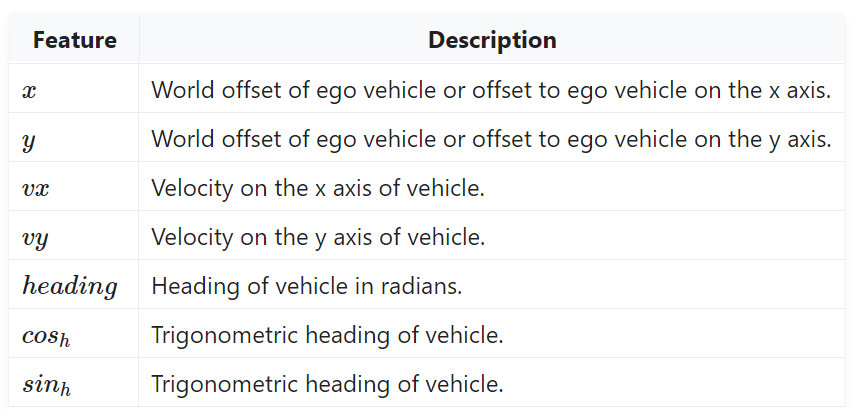
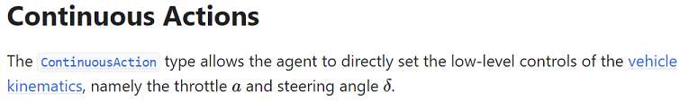
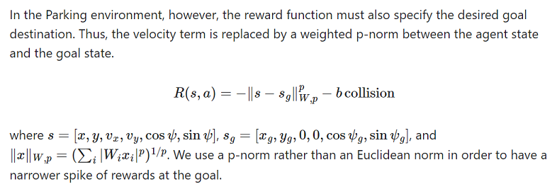
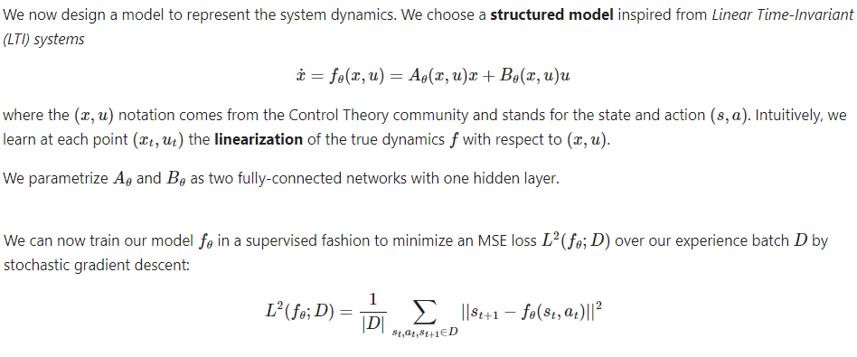
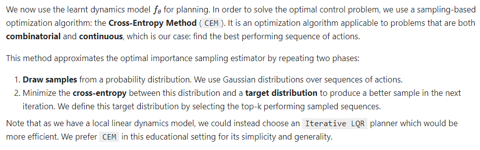

# Model Based RL

車をパーキングに駐車させる(Parking)、簡単なモデルベースの強化学習の事例。 
[HighwayEnv Scripts](https://github.com/Farama-Foundation/HighwayEnv/tree/master/scripts)の中のscriptをgoogle colabで動かしている。   

## Parking envの説明  

Parkingの構成はドキュメント[highway-env Documentation](https://highway-env.farama.org/environments/parking/)に説明がある。   

### 状態 spaces of observation  

位置x, 位置y, 速度vx, 速度vy, 方向cos_h, 方向sin_h　の6個のパラメータ    
  

### 行動 actions  

アクセルとハンドルの２個パラメーター  
    
    
### リワードreward  

ゴール地点の状態との差を使って評価している  

## 力学的モデル dynamics model  

  

A = self.A2(F.relu(self.A1(xu)))  reluを使ってA1の出力は０以上の数にしている。  
B = self.B2(F.relu(self.B1(xu)))  
policy_frequency 5  
 
## 計画 planner 
 
学習した力学的モデルを使って　1歩1歩　総当り的に？　調べて、アクションを決めていくのか？ model-free basedより効率が悪いとの説明あり。  

  

## ライセンス  
  
オリジナルコードのライセンスはLICENSE-HighwayEnv.txtを参照のこと。  

